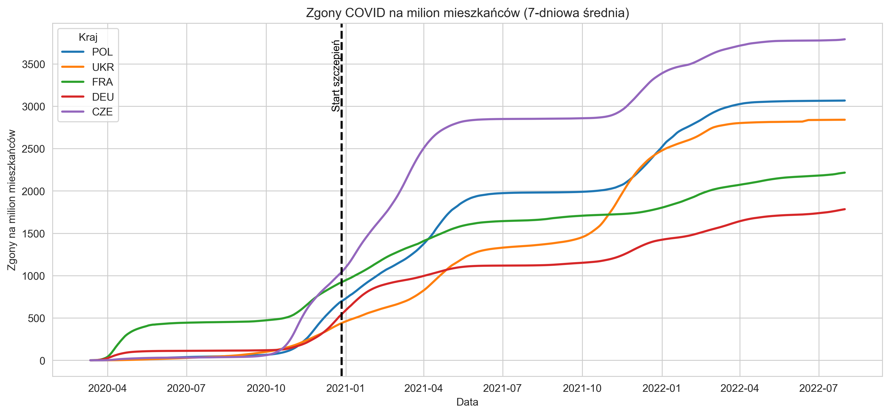
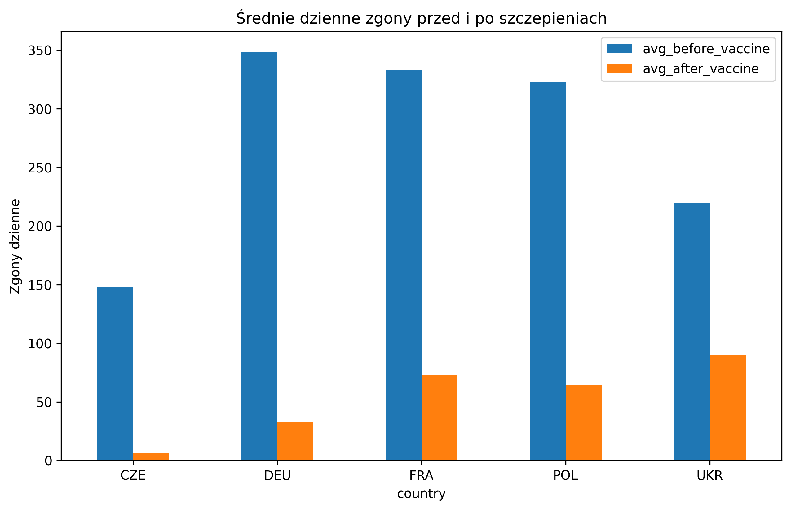
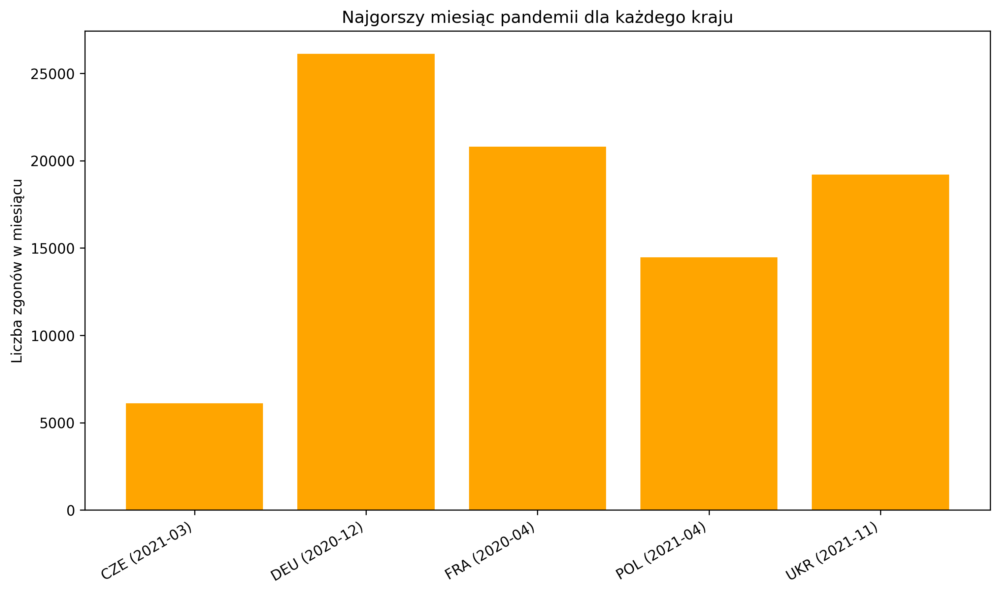

# COVID-19 Pandemic Analysis (Python + SQL)

## Project Workflow

This project demonstrates a complete data analysis pipeline:

```
Raw COVID dataset (CSV)
        │
        ▼
Data Cleaning & Transformation (Python / pandas)
        │
        ▼
Data Storage (SQLite database)
        │
        ▼
SQL Analysis (aggregations, ranking, comparisons)
        │
        ▼
Data Visualization (Matplotlib / Seaborn)
```

## Project Overview

This project analyzes COVID-19 pandemic data using **Python and SQL** in order to explore mortality trends and identify the most critical periods of the pandemic in selected European countries.

The analysis combines **time-series visualization in Python** with **aggregated statistical analysis using SQL**.

Countries analyzed in this project:

* Poland (POL)
* Ukraine (UKR)
* France (FRA)
* Germany (DEU)
* Czech Republic (CZE)

---

# Technologies Used

* Python
* SQL (SQLite)
* Pandas
* Matplotlib
* Seaborn

The project demonstrates a full data analysis pipeline:
data ingestion → data transformation → SQL analysis → visualization.
---

# Project Structure

```
covid-analysis
│
├── plots/                # Generated visualizations
├── covid_analysis.py     # Main Python analysis script
├── sql_queries.py        # SQL analysis queries
├── db_connection.py      # Database connection and saving data
├── covid_analysis.db     # SQLite database created by the script
├── covid_data.csv        # Source dataset
└── README.md
```

---

# Data Processing Approach

The project uses **two different approaches to analyze mortality data**.

### Python Analysis



In the Python part of the project, the analysis is based on **total cumulative deaths**.

Because the dataset contains cumulative values, the charts show **periods of increasing growth and flattening curves rather than decreasing values**.
To better visualize trends, **7-day rolling averages** were used to smooth daily fluctuations.

The Python analysis focuses mainly on:

* death trends over time
* vaccination rollout
* comparison between countries
* deaths per million inhabitants

It is important to note that the goal of this visualization is not to determine which country had the highest mortality per million inhabitants.
Such comparisons can be misleading because the dynamics of disease spread are influenced by many factors, including population size, density, reporting methods, and timing of infection waves.

Instead, the main focus of this analysis is on the overall shape of the curves and their flattening over time, which helps illustrate how mortality trends evolved during the pandemic and how they changed as vaccination campaigns progressed.

---

### SQL Analysis

For the SQL part of the project, the data is transformed into **daily death increases**.

This approach allows for more detailed statistical analysis such as:

* identifying the **highest number of deaths recorded in a single day**
* calculating **average daily deaths in different pandemic phases**
* determining the **worst pandemic month for each country**

Using daily increments instead of cumulative totals provides a clearer picture of **actual mortality spikes**.

---

# Vaccination Impact Analysis




One of the analyses compares **average daily deaths before and after the vaccination rollout**.

The following periods were used:

**Before vaccine effect**

January 1 – April 30

**After vaccine effect**

May 1 – August 31

Although vaccination campaigns started earlier in many countries, their effects cannot be observed immediately.

There are two main reasons for this delay:

1. Vaccination of a large portion of the population takes time.
2. Immunity develops gradually after vaccination.

Because of this delay, the analysis compares mortality data **several months after the vaccination rollout**, when the impact on public health becomes more visible.

---

# Worst Pandemic Month Analysis



Another part of the analysis identifies the **worst month of the pandemic for each country** based on the total number of deaths in that month.

This was calculated using SQL aggregation and window functions.

The goal of this analysis is to highlight when each country experienced its **most severe pandemic wave**.

---

# Why This Time Period Was Selected

The selected timeframe focuses primarily on the **first major waves of the COVID-19 pandemic**, when mortality spikes were most strongly linked to the initial spread of the virus and early policy responses.

Later increases in mortality observed in some countries were influenced by other factors such as:

* the emergence of new coronavirus variants
* early lifting of restrictions
* differences in vaccination rollout speed

Because of this, the analysis focuses on the earlier pandemic period to better capture the **initial pandemic dynamics**.

---

## Key Insights

The analysis revealed several important patterns:

- Different countries experienced peak mortality in different months.
- Vaccination rollout correlates with a gradual stabilization of death rates.
- Pandemic waves varied significantly depending on policy responses and healthcare capacity.

# Example Visualizations

Generated plots are stored in the `plots` folder.

The project includes visualizations such as:

* Deaths vs vaccinations trends
* Deaths per million comparison between countries
* Average daily deaths before and after vaccination
* Worst pandemic month for each country

---

## How to Run the Project

Install dependencies

```bash
pip install pandas matplotlib seaborn
```

Run Python analysis

```bash
python covid_analysis.py
```

Run SQL analysis

```bash
python sql_queries.py
```

# Author

Konrad Zomkowski


